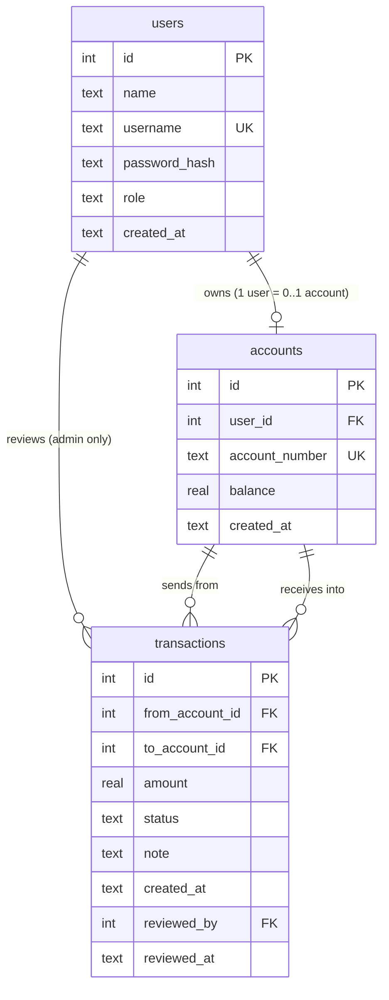
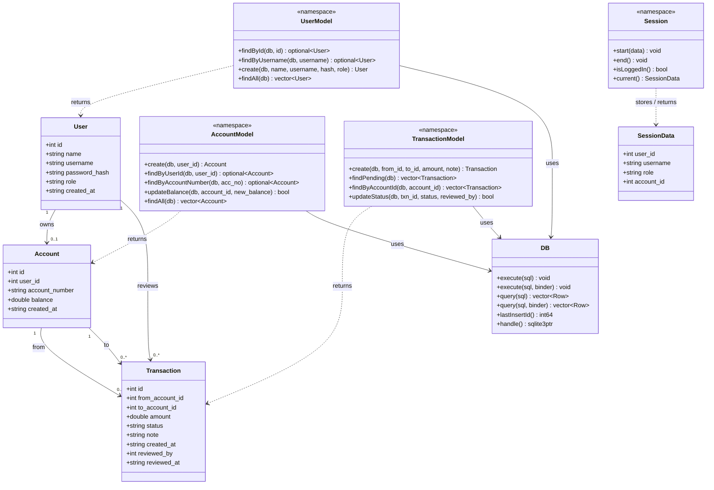
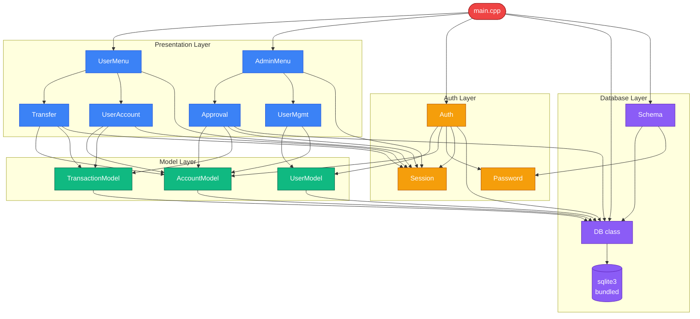
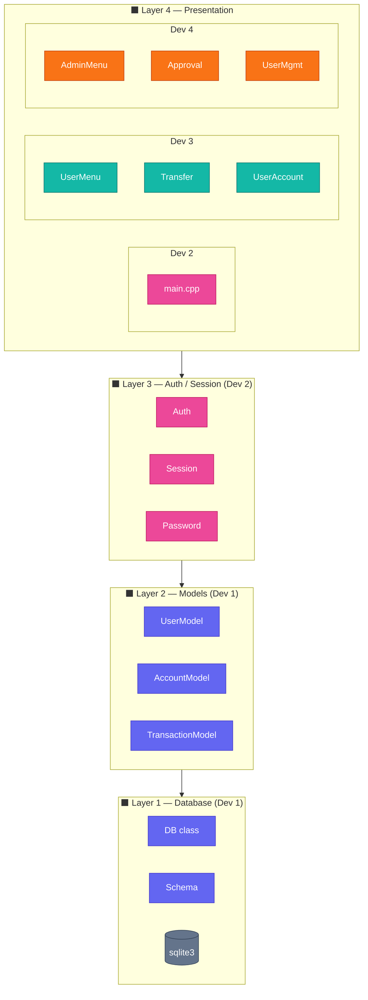
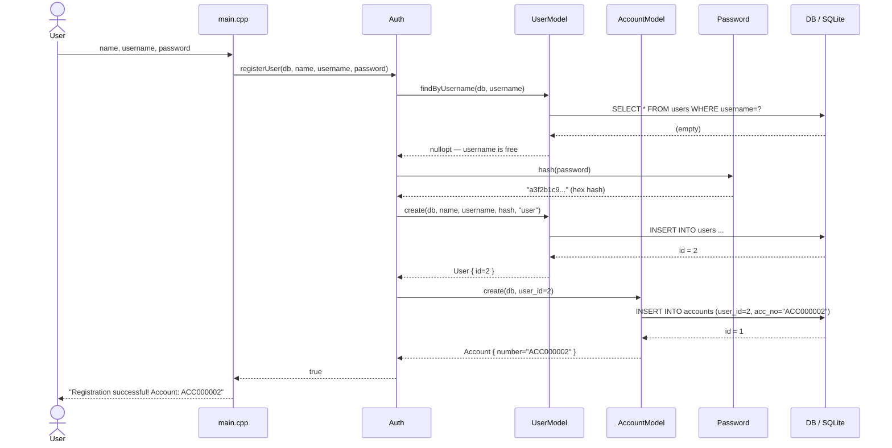
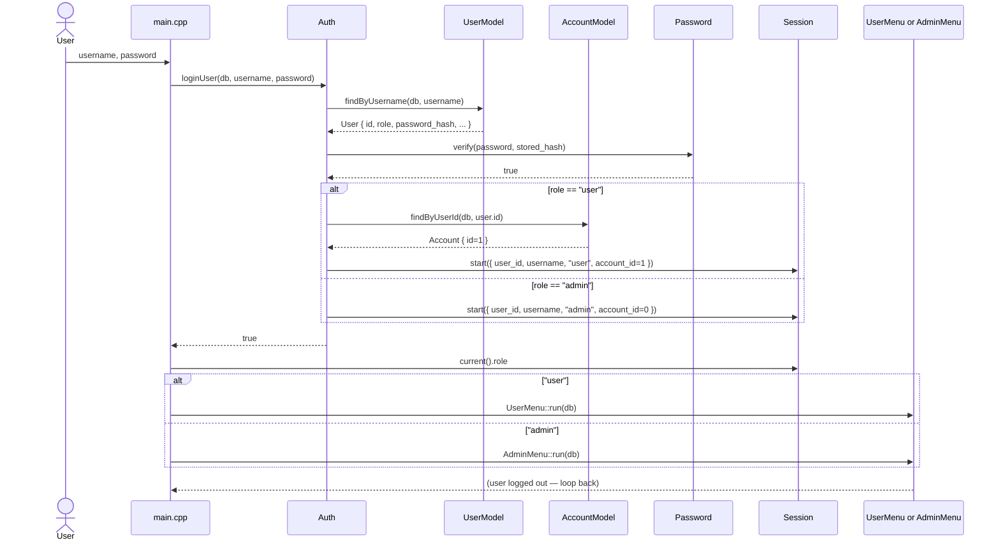
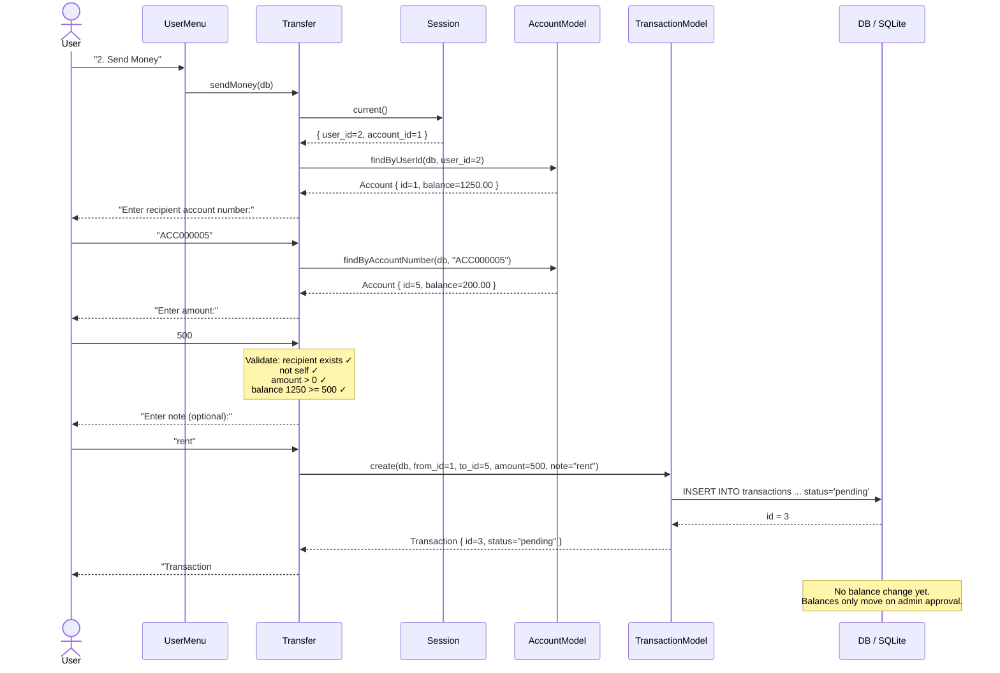
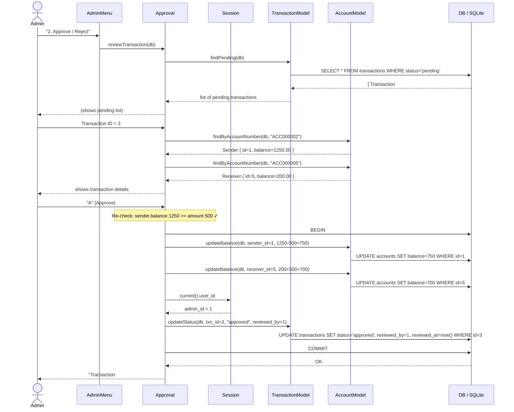
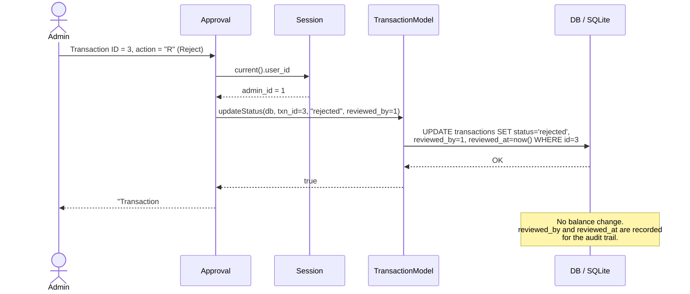

# Diagrams

All diagrams use [Mermaid](https://mermaid.js.org/) and render automatically on GitHub.

## Table of Contents
1. [Entity Relationship Diagram (ERD)](#1-entity-relationship-diagram-erd)
2. [C++ Data Structs & Model Methods](#2-c-data-structs--model-methods)
3. [Module Dependency Graph](#3-module-dependency-graph)
4. [Layer & Dev Ownership Map](#4-layer--dev-ownership-map)
5. [Sequence — Register](#5-sequence--register)
6. [Sequence — Login & Route](#6-sequence--login--route)
7. [Sequence — Send Money](#7-sequence--send-money)
8. [Sequence — Approve Transaction](#8-sequence--approve-transaction)
9. [Sequence — Reject Transaction](#9-sequence--reject-transaction)
10. [Transaction State Machine](#10-transaction-state-machine)

---

## 1. Entity Relationship Diagram (ERD)



### Constraint Reference

| Table | Column | Constraint | Effect |
|-------|--------|-----------|--------|
| users | username | UNIQUE | No duplicate logins |
| users | role | CHECK IN ('user','admin') | Only valid roles |
| accounts | balance | CHECK >= 0 | Balance never goes negative at DB level |
| accounts | account_number | UNIQUE | No duplicate account numbers |
| transactions | amount | CHECK > 0 | Zero / negative transfers blocked |
| transactions | status | CHECK IN ('pending','approved','rejected') | Only valid states |
| All FK cols | REFERENCES + FK pragma ON | Orphan rows impossible |

---

## 2. C++ Data Structs & Model Methods



---

## 3. Module Dependency Graph



---

## 4. Layer & Dev Ownership Map



---

## 5. Sequence — Register



---

## 6. Sequence — Login & Route



---

## 7. Sequence — Send Money



---

## 8. Sequence — Approve Transaction



---

## 9. Sequence — Reject Transaction



---

## 10. Transaction State Machine

```mermaid
stateDiagram-v2
    direction LR

    [*] --> PENDING : Transfer::sendMoney()\ncreates transaction row

    PENDING --> APPROVED : Admin approves\n──────────────\nsender.balance  -= amount\nreceiver.balance += amount\nreviewed_by = admin_id\nreviewed_at = now()

    PENDING --> REJECTED : Admin rejects\n──────────────\nno balance change\nreviewed_by = admin_id\nreviewed_at = now()

    APPROVED --> [*] : terminal state
    REJECTED --> [*] : terminal state

    note right of PENDING
        Balance check happens TWICE:
        1. At sendMoney (sender has enough?)
        2. At approve (re-checked in case
           another txn drained the balance)
    end note
```
